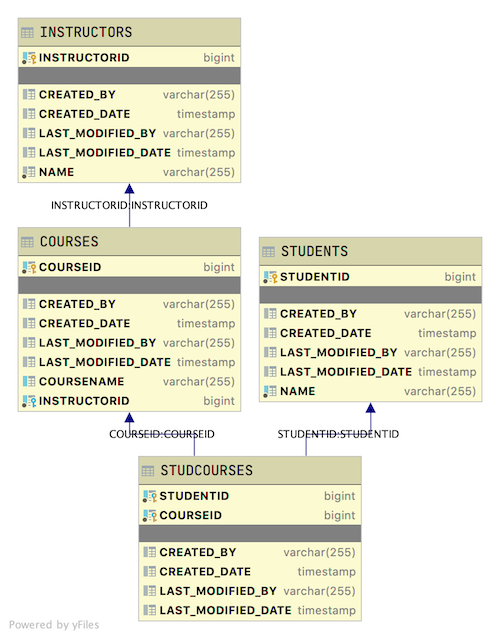

# Project School

A student that completes this project shows that they can:

* implement industry-standard exception handling including user-friendly exception messages
* implement exception handling using a variety of Java constructs
* use data validation annotations to verify data prior to processing the data
* implement custom Swagger Documentation
* gather and use data from other APIs

## Introduction

This is a standard database scheme with courses, students, and instructors. This Java Spring REST API application will provide endpoints for clients to perform the various CRUD operations on data sets contained in the application's data.

### Database layout

You are creating a Java Spring REST API server which stores data in an H2 database. The final table layouts should be



All tables contain the following auditing fields

* **created_by** - user name who created the row. Should default to SYSTEM
* **created_date** - date field when the row was created
* **last_modified_by** - user name who last changed data in the row. Should default to SYSTEM
* **last_modified_date** - date field when the data in the row was last changed

Table Relationships include

* Courses table is the driving table.
* Instructors have a Many-To-One relationship with Courses. Each instructor can teach many courses but each course will have only one instructor.
* Students have a Many-To-Many relationship with Courses. Students can take multiple courses and each course will have multiple students.

The starting application is not meant to be a complete, stand-alone application. The application has enough to complete the project but is missing many key endpoints such as endpoints related to instructors, PATCH endpoints, and a variety of necessary updates and deletes relating to many to many relationships.

For those available endpoints, using the provided seed data, this application returns the following data. Expand the section of the endpoint to see the data that is returned.

<details>
<summary>http://localhost:2019/courses/courses</summary>

```JSON
[
    {
        "courseid": 1,
        "coursename": "Data Science",
        "instructor": {
            "instructorid": 1,
            "name": "Sally"
        },
        "students": [
            {
                "student": {
                    "studentid": 1,
                    "name": "John"
                }
            },
            {
                "student": {
                    "studentid": 3,
                    "name": "Mary"
                }
            }
        ]
    },
    {
        "courseid": 2,
        "coursename": "JavaScript",
        "instructor": {
            "instructorid": 1,
            "name": "Sally"
        },
        "students": [
            {
                "student": {
                    "studentid": 2,
                    "name": "Julian"
                }
            }
        ]
    },
    {
        "courseid": 3,
        "coursename": "Node.js",
        "instructor": {
            "instructorid": 1,
            "name": "Sally"
        },
        "students": [
            {
                "student": {
                    "studentid": 3,
                    "name": "Mary"
                }
            }
        ]
    },
    {
        "courseid": 4,
        "coursename": "Java Back End",
        "instructor": {
            "instructorid": 2,
            "name": "Lucy"
        },
        "students": [
            {
                "student": {
                    "studentid": 1,
                    "name": "John"
                }
            }
        ]
    },
    {
        "courseid": 5,
        "coursename": "Mobile IOS",
        "instructor": {
            "instructorid": 2,
            "name": "Lucy"
        },
        "students": []
    },
    {
        "courseid": 6,
        "coursename": "Careers",
        "instructor": {
            "instructorid": 3,
            "name": "Charlie"
        },
        "students": [
            {
                "student": {
                    "studentid": 3,
                    "name": "Mary"
                }
            }
        ]
    }
]
```

</details>

<details>
<summary>http://localhost:2019/courses/course/6</summary>

```JSON
{
    "courseid": 6,
    "coursename": "Careers",
    "instructor": {
        "instructorid": 3,
        "name": "Charlie"
    },
    "students": [
        {
            "student": {
                "studentid": 3,
                "name": "Mary"
            }
        }
    ]
}
```

</details>

<details>
<summary>http://localhost:2019/students/students</summary>

```JSON
[
    {
        "studentid": 1,
        "name": "John",
        "courses": [
            {
                "course": {
                    "courseid": 1,
                    "coursename": "Data Science",
                    "instructor": {
                        "instructorid": 1,
                        "name": "Sally"
                    }
                }
            },
            {
                "course": {
                    "courseid": 4,
                    "coursename": "Java Back End",
                    "instructor": {
                        "instructorid": 2,
                        "name": "Lucy"
                    }
                }
            }
        ]
    },
    {
        "studentid": 2,
        "name": "Julian",
        "courses": [
            {
                "course": {
                    "courseid": 2,
                    "coursename": "JavaScript",
                    "instructor": {
                        "instructorid": 1,
                        "name": "Sally"
                    }
                }
            }
        ]
    },
    {
        "studentid": 3,
        "name": "Mary",
        "courses": [
            {
                "course": {
                    "courseid": 3,
                    "coursename": "Node.js",
                    "instructor": {
                        "instructorid": 1,
                        "name": "Sally"
                    }
                }
            },
            {
                "course": {
                    "courseid": 1,
                    "coursename": "Data Science",
                    "instructor": {
                        "instructorid": 1,
                        "name": "Sally"
                    }
                }
            },
            {
                "course": {
                    "courseid": 6,
                    "coursename": "Careers",
                    "instructor": {
                        "instructorid": 3,
                        "name": "Charlie"
                    }
                }
            }
        ]
    },
    {
        "studentid": 4,
        "name": "Julia",
        "courses": []
    },
    {
        "studentid": 5,
        "name": "Tyler",
        "courses": []
    },
    {
        "studentid": 6,
        "name": "Kim",
        "courses": []
    },
    {
        "studentid": 7,
        "name": "Juan",
        "courses": []
    },
    {
        "studentid": 8,
        "name": "Robby",
        "courses": []
    },
    {
        "studentid": 9,
        "name": "Roberto",
        "courses": []
    },
    {
        "studentid": 10,
        "name": "Bob",
        "courses": []
    },
    {
        "studentid": 11,
        "name": "Liz",
        "courses": []
    },
    {
        "studentid": 12,
        "name": "June",
        "courses": []
    },
    {
        "studentid": 13,
        "name": "April",
        "courses": []
    }
]
```

</details>

<details>
<summary>http://localhost:2019/students/student/3</summary>

```JSON
{
    "studentid": 3,
    "name": "Mary",
    "courses": [
        {
            "course": {
                "courseid": 3,
                "coursename": "Node.js",
                "instructor": {
                    "instructorid": 1,
                    "name": "Sally"
                }
            }
        },
        {
            "course": {
                "courseid": 1,
                "coursename": "Data Science",
                "instructor": {
                    "instructorid": 1,
                    "name": "Sally"
                }
            }
        },
        {
            "course": {
                "courseid": 6,
                "coursename": "Careers",
                "instructor": {
                    "instructorid": 3,
                    "name": "Charlie"
                }
            }
        }
    ]
}
```

</details>

<details>
<summary>POST http://localhost:2019/students/student</summary>

DATA

```JSON
{
    "name": "Shawn",
    "courses": [
        {
            "course": {
                "courseid": 1
            }
        },
        {
            "course": {
                "courseid": 2
            }
        },
        {
            "course": {
                "courseid": 3
            }
        }
    ]
}
```

OUTPUT

```TEXT
No Body Data

Location Header: http://localhost:2019/students/student/20
Status CREATED
```

</details>

<details>
<summary>PUT http://localhost:2019/students/student/20</summary>

DATA

```JSON
{
    "name": "Sean",
    "courses": [
        {
            "course": {
                "courseid": 1
            }
        },
        {
            "course": {
                "courseid": 2
            }
        }
    ]
}
```

OUTPUT

```TEXT
No Body Data

Status OK
```

</details>

<details>
<summary>DELETE http://localhost:2019/students/student/20</summary>

OUTPUT

```TEXT
No Body Data

Status OK
```

</details>

<details>
<summary>POST http://localhost:2019/courses/course</summary>

DATA

```JSON
{
    "coursename": "Lambda X",
    "instructor": {
        "instructorid": 3
    },
    "students": [
        {
            "student": {
                "studentid": 1
            }
        },
        {
            "student": {
                "studentid": 3
            }
        }
    ]
}
```

OUTPUT

```TEXT
No Body Data

Location Header: http://localhost:2019/courses/course/21
Status CREATED
```

</details>

<details>
<summary>PUT http://localhost:2019/courses/course/6</summary>

DATA

```JSON
{
    "courseid" : 6,
    "coursename": "Careers",
    "instructor": {
        "instructorid": 2
    },
    "students": [
        {
            "student": {
                "studentid": 1
            }
        },
        {
            "student": {
                "studentid": 3
            }
        }
    ]
}
```

OUTPUT

```TEXT
No Body Data

Status OK
```

</details>

<details>
<summary>DELETE http://localhost:2019/courses/course/6</summary>

OUTPUT

```TEXT
No Body Data

Status OK
```

</details>

After completing the project using the provided seed data, a successful application will return the following data based on the given endpoint. Only added or changed endpoints are shown below. Expand the section of the endpoint to see the data that is returned.

### MVP

<details>
<summary>http://localhost:2019/students/student/3333</summary>

```JSON
{
    "title": "Resource Not Found",
    "status": 404,
    "detail": "Found an error with School: Student id 3333 not found!",
    "timestamp": "2020-05-05T20:34:12.375+0000",
    "developerMessage": "com.lambdaschool.schools.exceptions.ResourceNotFoundException",
    "errors": []
}
```

</details>

<details>
<summary>http://localhost:2019/turtle</summary>

```JSON
{
    "title": "Rest Internal Exception",
    "status": 404,
    "detail": "Found an issue with School: No handler found for GET /turtle",
    "timestamp": "2020-05-05T20:34:38.579+0000",
    "developerMessage": "org.springframework.web.servlet.NoHandlerFoundException",
    "errors": []
}
```

</details>

<details>
<summary>http://localhost:2019/students/student/john</summary>

```JSON
{
    "title": "Rest Internal Exception",
    "status": 400,
    "detail": "Found an issue with School: Failed to convert value of type 'java.lang.String' to required type 'java.lang.Long'; nested exception is java.lang.NumberFormatException: For input string: \"john\"",
    "timestamp": "2020-05-05T20:35:06.657+0000",
    "developerMessage": "org.springframework.web.method.annotation.MethodArgumentTypeMismatchException",
    "errors": []
}
```

</details>

### Stretch Goals

<details>
<summary>http://localhost:2019/instructors/instructor/3/advice</summary>

```JSON
{
  "instructorid": 3,
  "name": "Charlie",
  "advice": "It is easy to sit up and take notice, what's difficult is getting up and taking action.",
  "courses": [
      {
          "courseid": 6,
          "coursename": "Careers",
          "students": [
              {
                  "student": {
                      "studentid": 3,
                      "name": "Mary"
                  }
              }
          ]
      }
  ]
}
```

</details>

<details>
<summary>http://localhost:2019/courses/course/6</summary>

```JSON
{
    "courseid": 6,
    "coursename": "Careers",
    "instructor": {
        "instructorid": 3,
        "name": "Charlie",
        "advice": null
    },
    "students": [
        {
            "student": {
                "studentid": 3,
                "name": "Mary"
            }
        }
    ]
}
```

</details>

[Swagger for School API](https://drive.google.com/open?id=1Xl542CN81taBcMM9dPo5KnscaRa1ZnUi)

Expand the endpoint to see a sample instructor with advice about dogs
  
<details>
<summary>http://localhost:2019/instructors/instructor/3/advice/dog</summary>

```JSON
{
    "instructorid": 3,
    "name": "Charlie",
    "advice": "Don't wear clean trousers when walking your dog in the park.",
    "courses": [
        {
            "courseid": 6,
            "coursename": "Careers",
            "students": [
                {
                    "student": {
                        "studentid": 3,
                        "name": "Mary"
                    }
                }
            ]
        }
    ]
}
```

</details>

Expand the endpoint to see a sample instructor with advice about weather
  
<details>
<summary>http://localhost:2019/instructors/instructor/3/advice/weather</summary>

```JSON
{
    "title": "Internal Server Error",
    "status": 500,
    "detail": "Found an issue with School: No message available",
    "timestamp": "2020-05-05T21:17:53.888+0000",
    "developerMessage": "path: /instructors/instructor/3/advice/weather",
    "errors": []
}
```

</details>

Prevent null advice from displaying

<details>
<summary>http://localhost:2019/courses/course/6</summary>

```JSON
{
    "courseid": 6,
    "coursename": "Careers",
    "instructor": {
        "instructorid": 3,
        "name": "Charlie"
    },
    "students": [
        {
            "student": {
                "studentid": 3,
                "name": "Mary"
            }
        }
    ]
}
```

</details>

## Instructions

* [ ] Please fork and clone this repository.
* [ ] This repository does have a starter project, so you must start with that application inside of the cloned repository folder. Regularly commit and push your code as appropriate.
* [ ] A data.sql file has been provided with seed data. You can use this class directly or modify it to fit your models. However, the data found in the file is the seed data to use!

### MVP

Add appropriate exception handling routines.

* [ ] You must specifically handle the following exceptions:
  * [ ] a resource is not found where it should be - for example, you look up a student who is not there
  * [ ] a resource is found where it should not be - for example, you try to enroll a student in a course where they are already enrolled
  * [ ] a non-handled endpoint is accessed (a URL not found exception)
* [ ] All other exceptions should be handled by some generic exception handled that you provide.
* [ ] All exception messages should start with the phrase "Found an issue with School: " followed by any system-generated messages you think appropriate.
* [ ] The following is the format for the error messages
  * **Title** - The title of the exception
  * **Status** - Http Status Code
  * **detail** - Detailed message for the client
  * **timestamp** - date and time of the exception
  * **developer** -  message for developers about this error message, things like class and code causing the error
  * **List of Validation Errors** - If data validation errors caused this error, the list of them will appear here

### Stretch Goal

Add Validations

* [ ] Add the following validations to your code
  * [ ] Course Model
    * [ ] Coursename
      * [ ] Not Null
      * [ ] Minimum 2 characters
      * [ ] Maximum 50 characters
  * [ ] Student Model
    * [ ] Name
      * [ ] Not Null
      * [ ] Minimum 2 characters
      * [ ] Maximum 30 characters
  * [ ] Instructor Model
    * [ ] Name
      * [ ] Not Null
      * [ ] Minimum 2 characters
      * [ ] Maximum 30 characters
  * [ ] Each validation should report an appropriate exception message if violated

Get Data from External API

* [ ] Create an endpoint **/instructors/instructor/{instructorid}/advice** that returns the instructor's information plus random advice from an external API.
  * [ ] The route of the external API is [https://api.adviceslip.com/advice](https://api.adviceslip.com/advice) and yields the JSON Object

  ```JSON
  {
    "slip": {
        "id": "2",
        "advice": "Smile and the world smiles with you. Frown and you're on your own."
    }
  }
  ```

  <details>
  <summary>Hint:</summary>

  * [ ] Add a transient field called **advice** to the instructor model.
    * Note: Other endpoints that return instructor will include an empty advice field.
  
  * [ ] Create a model to represent the advice slip class
  
  * [ ] Create the instructor repository
  
  * [ ] Create the instructor service
    * [ ] Create a method called **addAdvice**
      * [ ] Find the instructor using the repository **findById**
      * [ ] get a random advice from the API
        * [ ] The API returns the slip JSON from above
        * [ ] The API returns data in media type text/html
      * [ ] set the advice field to the advice received from the API
      * [ ] return that modified instructor object to the controller
    * [ ] The controller returns the modified instructor object to the client.

  </details>

  Expand the endpoint to see a sample instructor with advice
  
  <details>
  <summary>http://localhost:2019/instructors/instructor/3/advice</summary>

  ```JSON
  {
    "instructorid": 3,
    "name": "Charlie",
    "advice": "It is easy to sit up and take notice, what's difficult is getting up and taking action.",
    "courses": [
        {
            "courseid": 6,
            "coursename": "Careers",
            "students": [
                {
                    "student": {
                        "studentid": 3,
                        "name": "Mary"
                    }
                }
            ]
        }
    ]
  }
  ```

</details>

Custom Swagger Documentation

* [ ] Add custom Swagger Documentation for
  * [ ] All endpoints in the Courses Controller
  * [ ] All fields in the Courses model
  * [ ] All the validations added above should be documented in Swagger
  * [ ] Swagger API-Information should point to your information

Use a search term for the advice

* [ ] Create an endpoint **/instructors/instructor/{instructorid}/advice/{search term}** that returns the instructor's information plus advice based off of the search term from an external API.

The route of the external API is [https://api.adviceslip.com/advice/search/dog](https://api.adviceslip.com/advice/search/dog) and yields the JSON Object

  ```JSON
  {
      "total_results": "1",
      "query": "dog",
      "slips": [
          {
              "id": 27,
              "advice": "Don't wear clean trousers when walking your dog in the park.",
              "date": "2014-10-12"
          }
      ]
  }
  ```

Notice that this returns a list of advices. We are interested in returning the first one in the list. A general error message should be reported if the search term returns no advice.

Expand the endpoint to see a sample instructor with advice about dogs
  
<details>
<summary>http://localhost:2019/instructors/instructor/3/advice/dog</summary>

```JSON
{
    "instructorid": 3,
    "name": "Charlie",
    "advice": "Don't wear clean trousers when walking your dog in the park.",
    "courses": [
        {
            "courseid": 6,
            "coursename": "Careers",
            "students": [
                {
                    "student": {
                        "studentid": 3,
                        "name": "Mary"
                    }
                }
            ]
        }
    ]
}
```

</details>

Expand the endpoint to see a sample instructor with advice about weather
  
<details>
<summary>http://localhost:2019/instructors/instructor/3/advice/weather</summary>

```JSON
{
    "title": "Internal Server Error",
    "status": 500,
    "detail": "Found an issue with School: No message available",
    "timestamp": "2020-05-05T21:17:53.888+0000",
    "developerMessage": "path: /instructors/instructor/3/advice/weather",
    "errors": []
}
```

</details>

Prevent null advice from displaying

* [ ] When an instructor model has no advice, the advice field is null, do not display the advice field in the JSON sent to the client. See [https://www.baeldung.com/jackson-ignore-null-fields](https://www.baeldung.com/jackson-ignore-null-fields) for insight.

<details>
<summary>http://localhost:2019/courses/course/6</summary>

```JSON
{
    "courseid": 6,
    "coursename": "Careers",
    "instructor": {
        "instructorid": 3,
        "name": "Charlie"
    },
    "students": [
        {
            "student": {
                "studentid": 3,
                "name": "Mary"
            }
        }
    ]
}```

</details>
